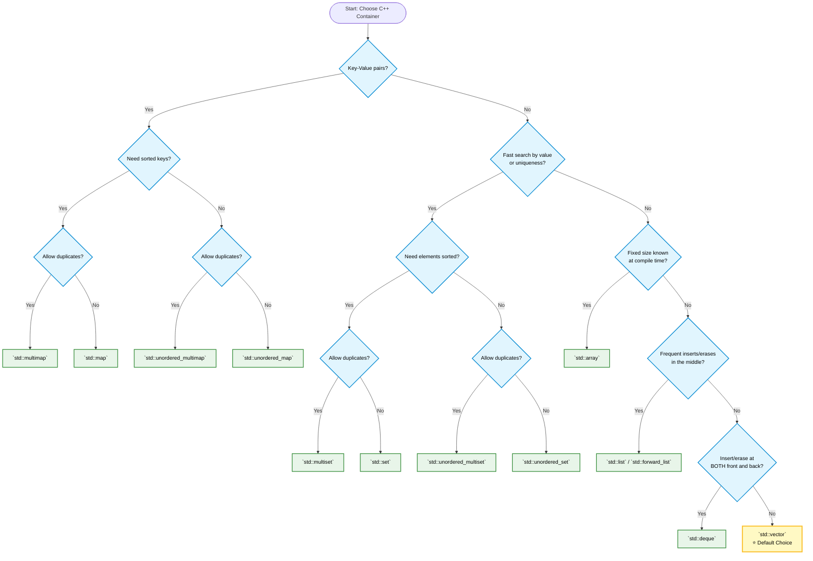

# Standard Template Library (STL) in C++

This repository serves as a comprehensive, technical reference for the C++ Standard Template Library (STL). It provides in-depth examples, architectural breakdowns, and performance analyses for STL containers, iterators, and algorithms. The objective is to bridge the gap between basic C++ syntax and high-performance competitive programming or production-level engineering.

Each module within the repository details the underlying data structures, strict time complexities (Big-O notation), iterator invalidation rules, and edge cases to prevent undefined behavior.

## Target Demographic

- **Competitive Programmers**: Optimized reference material for container operations, custom comparators, hash collision mitigation, and Order Statistics Trees (PBDS).
- **Software Engineers**: A structured refresher on C++ container selection, strict weak ordering, and memory management (e.g., `reserve` vs `resize`).
- **Students**: A stepping stone from basic C++ data structures to standard library mastery.

## Build and Execution

The repository includes a unified build system to compile and test all modules. It requires GCC and Make. It compiles using the `std=c++2b` standard and applies the `-DLOCAL` flag to support local file redirection without hanging.

```sh
# Compile all executable files
make -f Makefile all

# Execute all binaries and route stdout to local Output.txt files
make -f Makefile run

# Clean build artifacts
make -f Makefile clean
```

## Code Standards & Conventions

The codebase adheres strictly to a custom professional style guide:
- **Formatting**: 4-space indentation, Allman brace style, and block comments (`/* ... */`) exclusively.
- **Performance**: `\n` is used universally over `std::endl` to prevent expensive output buffer flushing.
- **Environment**: `#include <bits/stdc++.h>` and `freopen()` are utilized for brevity and rapid local testing. These are standard in competitive programming but should be refactored for production environments.

---

## STL Containers Overview

| Container        | Underlying Structure   | Supports Iterators        | Random Access | Allows Duplicates | Sorted               |
| :--------------- | :--------------------- | :------------------------ | :------------ | :---------------- | :------------------- |
| `array`          | Fixed-size array       | **✓ Yes**                 | **✓ Yes**     | **✓ Yes**         | ✗ No                 |
| `vector`         | Dynamic array          | **✓ Yes**                 | **✓ Yes**     | **✓ Yes**         | ✗ No                 |
| `deque`          | Doubly-ended queue     | **✓ Yes**                 | **✓ Yes**     | **✓ Yes**         | ✗ No                 |
| `list`           | Doubly linked list     | **✓ Yes** (Bidirectional) | ✗ No          | **✓ Yes**         | ✗ No                 |
| `stack`          | LIFO (deque/vector)    | ✗ No (Top only)           | ✗ No          | **✓ Yes**         | ✗ No                 |
| `queue`          | FIFO (deque/list)      | ✗ No (Front/Back)         | ✗ No          | **✓ Yes**         | ✗ No                 |
| `priority_queue` | Binary Heap            | ✗ No (Top only)           | ✗ No          | **✓ Yes**         | **✓ Yes** (Max Heap) |
| `set`            | Balanced BST (RB-Tree) | **✓ Yes**                 | ✗ No          | ✗ No (Unique)     | **✓ Yes**            |
| `multiset`       | Balanced BST (RB-Tree) | **✓ Yes**                 | ✗ No          | **✓ Yes**         | **✓ Yes**            |
| `unordered_set`  | Hash Table             | **✓ Yes**                 | ✗ No          | ✗ No (Unique)     | ✗ No                 |
| `map`            | Balanced BST (RB-Tree) | **✓ Yes**                 | ✗ No          | ✗ No (Unique)     | **✓ Yes** (By Key)   |
| `multimap`       | Balanced BST (RB-Tree) | **✓ Yes**                 | ✗ No          | **✓ Yes**         | **✓ Yes** (By Key)   |
| `unordered_map`  | Hash Table             | **✓ Yes**                 | ✗ No          | ✗ No (Unique)     | ✗ No                 |
| `pair`           | Structured Binding     | ✗ No                      | ✗ No          | **✓ Yes**         | ✗ No                 |
| `tuple`          | Heterogeneous Sequence | ✗ No                      | ✗ No          | **✓ Yes**         | ✗ No                 |
---

## Modules Covered

### Sequential Containers
- `array`, `vector`, `deque`, `list`

### Associative Containers
- **Ordered**: `set`, `multiset`, `map`, `multimap`
- **Unordered**: `unordered_set`, `unordered_map`

### Container Adapters
- `stack`, `queue`, `priority_queue`

### Utility & Core Concepts
- `algorithms` (Sorting, Searching, Modifying)
- `iterators` (Categories, Adapters, Invalidation rules)
- `predicate_functions` (Custom Comparators, Strict Weak Ordering)
- `custom_hash_function` (SplitMix64 implementation for collision defense)
- `pair_and_tuple`, `bitset`

### GCC Extensions
- `policy_based_data_structures` (Order Statistics Tree for O(log N) indexing and k-th element lookups)

---

## Container Selection Matrix



---

## Asymptotic Complexity Matrix

| Operation        | `vector`       | `deque` | `list` | `set`/`map`    | `unordered_set/map` |
| ---------------- | -------------- | ------- | ------ | -------------- | ------------------- |
| **Access `[i]`** | O(1)           | O(1)    | O(N)   | O(log N) (Map) | O(1) avg (Map)      |
| **Insert front** | O(N)           | O(1)    | O(1)   | —              | —                   |
| **Insert back**  | O(1) Amortized | O(1)    | O(1)   | —              | —                   |
| **Insert mid**   | O(N)           | O(N)    | O(1)*  | O(log N)       | O(1) avg            |
| **Erase mid**    | O(N)           | O(N)    | O(1)*  | O(log N)       | O(1) avg            |
| **Find**         | O(N)           | O(N)    | O(N)   | O(log N)       | O(1) avg            |

*\* Note: O(1) insertion/erasure in `list` assumes the iterator is already pointing to the target position. Finding that position still requires O(N) traversal.*
