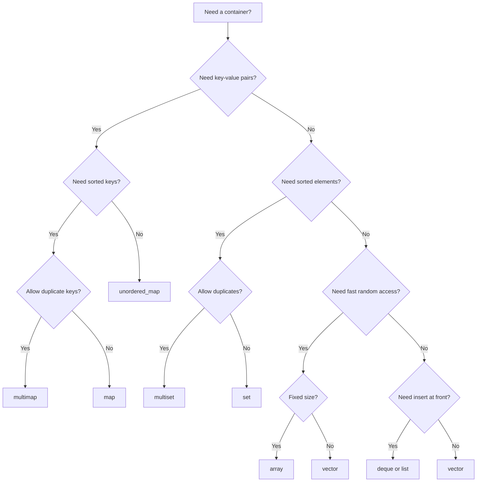

# Standard Template Library (STL) in C++
This repository provides a comprehensive explanation and examples for various **STL containers, algorithms, and iterators** in C++. Each topic includes details on **underlying data structures, time complexities, common pitfalls, and when to use them**.

## 🎯 Who Is This For?
- **Competitive Programmers (CP)**: Looking for fast reference on container operations, custom comparators, and performance tuning.
- **Interview Candidates**: Reviewing STL before technical interviews (especially the flowchart and complexity cheat sheets).
- **C++ Students**: Learning the standard library beyond basic arrays and pointers.

> **Note on Code Style:** All code examples use competitive-programming conventions for brevity:
> - `#include <bits/stdc++.h>` — GCC-only catch-all header.
> - `#define endl "\n"` — Faster output flushing.
> - `freopen()` — File-based I/O for local testing.
> *(These patterns are standard in CP, but are not recommended for production C++ code).*

## STL Containers Overview

| Container | Data Structure | Supports Iterators | Random Access | Allows Duplicates | Sorted |
|-----------|---------------|--------------------|---------------|------------------|--------|
| `array` | Fixed-size array | [x] Yes | [x] Yes | [x] Yes | [ ] No |
| `vector` | Dynamic array | [x] Yes | [x] Yes | [x] Yes | [ ] No |
| `deque` | Doubly-ended queue | [x] Yes | [x] Yes | [x] Yes | [ ] No |
| `list` | Doubly linked list | [x] Yes (Bidirectional) | [ ] No | [x] Yes | [ ] No |
| `stack` | LIFO structure (uses `deque` or `vector`) | [ ] No (only top) | [ ] No | [x] Yes | [ ] No |
| `queue` | FIFO structure (uses `deque` or `list`) | [ ] No (only front & back) | [ ] No | [x] Yes | [ ] No |
| `priority_queue` | Heap (binary heap by default) | [ ] No (only top) | [ ] No | [x] Yes | [x] Yes (Max Heap by default) |
| `set` | Balanced BST (Red-Black Tree) | [x] Yes | [ ] No | [ ] No (unique values) | [x] Yes |
| `multiset` | Balanced BST (Red-Black Tree) | [x] Yes | [ ] No | [x] Yes | [x] Yes |
| `unordered_set` | Hash Table | [x] Yes | [ ] No | [ ] No (unique values) | [ ] No |
| `map` | Balanced BST (Red-Black Tree) | [x] Yes | [ ] No | [ ] No (unique keys) | [x] Yes (by key) |
| `multimap` | Balanced BST (Red-Black Tree) | [x] Yes | [ ] No | [x] Yes | [x] Yes (by key) |
| `unordered_map` | Hash Table | [x] Yes | [ ] No | [ ] No (unique keys) | [ ] No |
| `pair` | Simple data container | [ ] No | [ ] No | [x] Yes | [ ] No |
| `tuple` | Fixed-size heterogeneous container | [ ] No | [ ] No | [x] Yes | [ ] No |

---

## STL Topics Covered

### [x] Sequential Containers
- `array`
- `vector`
- `deque`
- `list`
- `forward_list` (Coming soon)

### [x] Associative Containers
#### Ordered
- `set`, `multiset`
- `map`, `multimap`

#### Unordered
- `unordered_set`
- `unordered_map`

### [x] Container Adapters
- `stack`
- `queue`
- `priority_queue`

### [x] Utility Components
- `pair`
- `tuple`
- `bitset`

### [x] Algorithms & Core Concepts
- `algorithms` (Sorting, Searching, Modifying)
- `iterators` (Categories, Adapters, Invalidation)
- `Predicate Functions` (Custom Comparators)
- `custom_hash function` (SplitMix64)

### Extensions
- `policy_based_data_structures` (GCC Extensions like Order Statistics Tree)

---

## Container Selection Flowchart



---

## Big-O Complexity Cheat Sheet

| Operation | `vector` | `deque` | `list` | `set`/`map` | `unordered_set/map` |
|-----------|----------|---------|--------|-------------|---------------------|
| **Access `[i]`** | O(1) | O(1) | O(N) | O(log N) (Map) | O(1) avg (Map) |
| **Insert front** | O(N) | O(1) | O(1) | — | — |
| **Insert back** | O(1)* | O(1) | O(1) | — | — |
| **Insert mid** | O(N) | O(N) | O(1)** | O(log N) | O(1) avg |
| **Erase mid** | O(N) | O(N) | O(1)** | O(log N) | O(1) avg |
| **Find** | O(N) | O(N) | O(N) | O(log N) | O(1) avg |

*\* Amortized O(1)*
*\*\* Assuming you already have an iterator pointing to the element.*

---

## 📖 What’s Inside?
Each STL container has its own file with:
- **Definition & Usage**
- **All Member Functions**
- **Time Complexity**
- **Examples & Edge Cases**
- **Sorting, Searching, & Modifications**

---

## How to Run?
Clone this repository and compile any STL example using:

```sh
g++ -O3 -o filename filename.cpp
```
Then,
```
./filename
```

